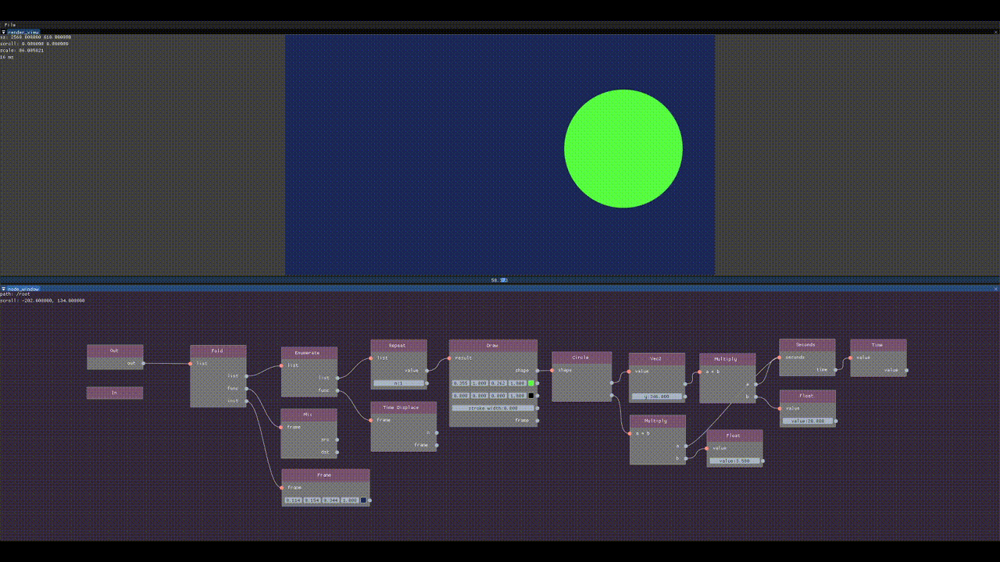
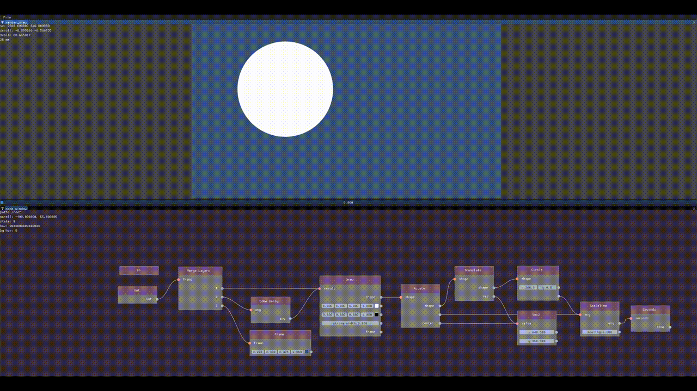

# YAVE - Functional Reactive Visual Programming Language

`YAVE` is node based visual programming environment with functional reactive programming (FRP).  
Aiming for research on animation software which bridges gaps between declarative editing paradigm and generative methods.

*Disclaimer: This project is still in very early stage!*

To play around with `YAVE`, you can also build from source with standard CMake on Win/Linux.  
There are also CI compiled binary artifacts, but they might not work on some environments.  
If you have any problem, feel free to report or ask on gitter.

## Motivation

Procedural content creation with node based visual programming languages are quite popular in audio and graphics domain because of its flexibility and usability for artists.  
With node based languages, you specify how data will be transformed into final output by using data flow graph, which is quite easy to understand even for non-programmers.  
However, once you start to compose values which *change over time* (like animations), things will get complicated quickly. This is because you need to calculate *how* current time maps to value rather than *what* kind of operation you want to apply on time related to values. This is different from traditional editing software which are usually based on *declarative* time manipulation.
This is well known problem in functional programming community, and they found elegant solution by using higher-order functions which commonly known as `Functional Reactive Programming (FRP)`.  
Even though FRP is very popular in FP (mainly Haskell) community, implementations as visual programming language are almost non-existent1.
This project is currently aiming for static content creation tools like animation or video editing (not for making GUI or games). 

1 I actually haven't seen any other working implementation yet. So this might be the first one.

## Features

* Functional programming
  * `YAVE` supports various functional programming features, including higher-order functions and currying.
  * Each 'sub-graph' can be used as function when there's no input.
  * Recursion is currently not supported to avoid infinite loops. It is recommended to implement your recursive algorithm in C++ (which is much faster) or use higher-order combinators.

* Reactivity and declarative time manipulation
  * `YAVE` is based on *functional reactive programming (FRP)*. All node functions are internally represented as *signal function (`SF a b`)*.
  * FRP enables you to transform any value over time from caller side. For example, you can make single animation and combine them with different time scales/delays without modifying original animation.
  * For example, `Time.ReTime` sets new time to input value.

* Type system
  * `YAVE` is statically typed language.
  * Type system of `YAVE` is based on classic Hindly-Milner type inference, with some extension to support ad-hoc overloading.
  * Type errors are currently displayed very poorly. I'm planning to improve that.

* Fully interoperable with C++
  * Functional programming languages tend to lack support of GUI and high performance graphics, which are must for practical visual scripting environment. `YAVE` avoids this limitation by implementing functional runtime system as EDSL (embedded domain specific language) on C++. 
  * You add new data types or implement your own node functions from C++. Object system of `YAVE` is designed to support plugin style extensions in the future.
  
### Nodes 101

* Function node

Function nodes represent 'backend' functions. It can be used for either function call (when all arguments are connected) or 'lambda mode' (when there's no input). Lambda mode is used to pass function as value instead of calling it.  
Example: `Num.Float`,  `Num.Int`, etc.

Note: `YAVE` currently does not have flat lambda introducer like other functional visual programming languages. You always need to create group first, then use it as lambda mode to pass user-defined functions to higher-order functions (this means you always need to use `let f x =...` rather than `\x ->...`, in analogy to textual languages). Any partially connected nodes are rejected by parser, to simplify syntax for now.

Note: Some function nodes has default values for some sockets which can be changed from GUI. These are treated as connected to invisible node.

* Group node

Group nodes have multiple roles in `YAVE`.  
Groups can be used as user-defined functions (same as function nodes), and it also creates its own namespace. Namespaces created by groups can be used as path to find and reference functions from anywhere.

* Macro node

Macro nodes are used to procedurally generate nodes from arbitrary number of inputs. For example, `List.List` is macro node which generates tree by `List.Cons` and `List.Nil`. Macro nodes will be expanded in parser stage.

## Implementation

`YAVE` is implemented in C++20 (moving from C++17).    

This project heavily exploits metaprogramming capability of modern C++. For example, runtime representation of node functions (including runtime type information) are generated through templates. It event has compile time type checker to verify usage of runtime typed objects inside node functions.  

`YAVE`'s node compiler translates node graph into small functional runtime implemented in C++.  
There's no code generation or caching optimizations yet.  
Vulkan API is used for graphics backend and user interface.

## Development

### Current Plans

This project is still in very early stage. There are still lots of things to be implemented.

To-Do list:

* Proper engineering as GUI application
  - There are tons of terrible codes/designs in the codebase, which I eager to rewrite.
  - Current GUI frontend is prototype with ImGui which has some limitations.
    + Qt or custom UI framework with Vulkan might be better for future development.
  
* Runtime improvements
  - Introducing evaluation context
  - Optimization paths
  - Parallel scheduling support
  - Multi output support
  - Dynamic caching
  
* Type system improvements
  - Improve error message
  - Display principal types on GUI
  - Replace current hacky type inference implementation..
  
* Nodes
  - Always add more useful nodes!
  - Improve vector graphics support
  - GLSL, Python script nodes

### Building

To build `YAVE`, you need compilers which support some features of C++20.
Currently following compilers are used for development:

- VS2019 Preview (Win)
- Clang 10 (Linux)
- GCC 10 (Linux)

You also need CMake and VulkanSDK.  
First build may take longer time to build dependencies. 

## License

LGPLv3  

## Contributors

+ Atsushi Nagaoka (@mocabe)

## Gallery

Note: These screenshots and gifs can be outdated.

